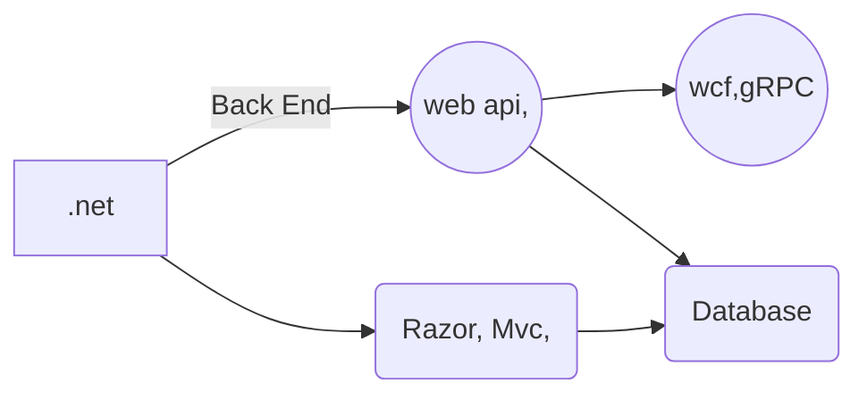

# Welcome to SdeZone Profile!

Hi! I'm computer engineer and keen on back-end front-end and mobile application development. I will update this profile information 

 - C#, Asp.Net MVC, Web Api, Wpf, Asp.Net, React, Angular, Vue, EF,   
   Dapper, Linq, TSQL Java, Spring Boot, Quarkus, Jpa, Hibernate Mssql, 
   Mysql, Postgresql, MongoDB,nodejs,golang

Below graph is just for testing and not completed yet however this will also be updated.



```mermaid
graph LR
A[java] -- Back End --> B((spring boot,)) --> E((quarkus))
A --> C(React,Angular,Vue)
B --> D{JPA,hibernate}
C --> D(Database)
